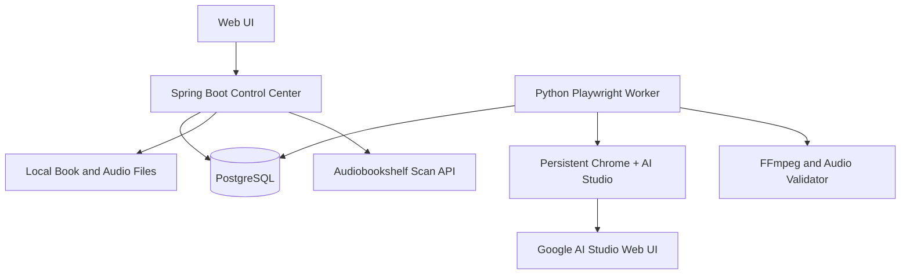
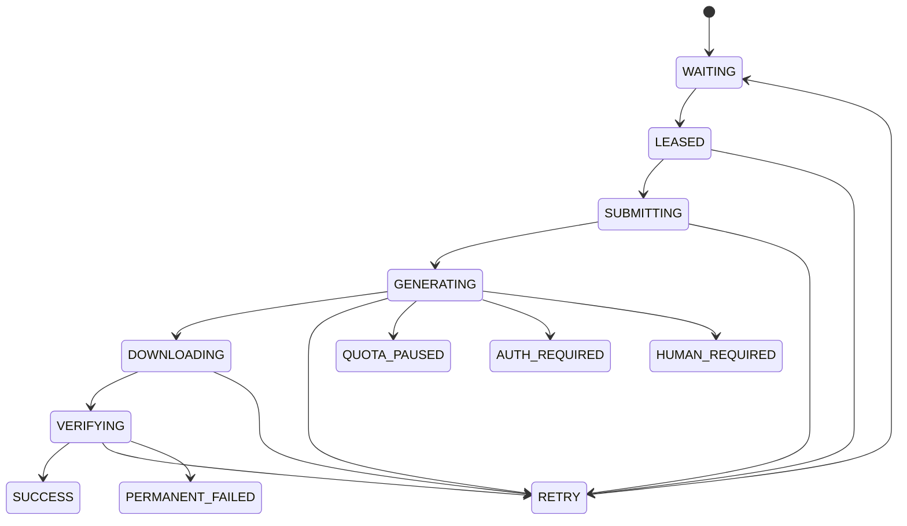

# 私人有声书工厂设计规格

- 状态：待审阅
- 日期：2026-09-04
- 项目：`plfccc/audiobook-factory`
- 目标：在 Ubuntu 8C8G 服务器上，使用单个手动登录的 Google AI Studio 浏览器会话，将书籍文本稳定地转换为可在 Audiobookshelf 中播放的有声书。

## 1. 目标与边界

### 1.1 目标

1. 支持 TXT、Markdown，后续支持 EPUB 导入。
2. 按章节和语义完整句子切分文本，生成可重试、可恢复的片段任务。
3. 通过持久化 Chrome + Playwright 控制 Google AI Studio 网页端完成文字转语音。
4. 支持试听、批量生成、失败重试、暂停、继续和从中断处恢复。
5. 校验音频文件，按章节合并为 MP3/M4B，并发布到 Audiobookshelf。
6. 保留 Provider 抽象，未来可以增加 Gemini API、本地 TTS 等实现。

### 1.2 明确不做

- 不自动填写 Google 密码、恢复邮箱或 2FA 信息。
- 不做多账号轮换、代理轮换、验证码绕过、反检测或额度绕过。
- 不把 Google AI Studio 页面当作稳定公开 API；所有页面交互都封装在 Provider Adapter 内。
- P0 不引入 Redis、Temporal、对象存储或多 Worker 集群。
- 不在第一阶段做 AI Agent 自主修复页面；异常先通过截图、DOM、控制台日志和人工确认处理。

## 2. 设计原则

- 浏览器自动化只负责“打开页面、填入参数、提交生成、下载结果”；业务状态由后端数据库管理。
- 任务必须可幂等。相同书籍、版本、章节、片段和预设不能重复产生无法追踪的结果。
- 外部网页是不稳定边界：每个阶段都有超时、截图、日志和明确错误分类。
- 本地文件是第一阶段的音频事实来源，数据库保存元数据、状态和路径。
- 单 Worker 先跑通可靠闭环，再扩展并发；不要用并发掩盖网页端不确定性。

## 3. 总体架构



### 3.1 组件职责

| 组件 | 技术 | 职责 |
|---|---|---|
| Control Center | Spring Boot 3 + Java 17/21 | 书籍、章节、片段、预设、任务调度、状态查询 |
| Database | PostgreSQL | 任务状态、租约、重试、错误、音频元数据 |
| Browser Worker | Python + Playwright | 领取任务并控制浏览器完成一次 TTS 生成 |
| Browser Runtime | Chromium + Xvfb + x11vnc/noVNC | 保存登录态，允许 SSH 隧道人工登录和排障 |
| Audio Pipeline | FFmpeg + ffprobe | 音频校验、转码、章节合并、M4B 生成 |
| Library | Audiobookshelf | 扫描、管理和播放最终音频 |

## 4. 关键流程

### 4.1 首次部署和登录

1. Docker 启动 PostgreSQL、Control Center、Browser Worker 和 Chrome Runtime。
2. Chrome 使用宿主机持久化目录保存浏览器 Profile。
3. 通过 SSH 隧道访问 noVNC；不将 6080、9222 或 Chrome 调试端口暴露到公网。
4. 用户在可视化浏览器中手动完成 Google 登录和必要的人机验证。
5. Worker 通过本机或 Docker 内部网络连接 CDP，检查 AI Studio 页面、登录状态和 TTS 页面可用性。
6. 服务器重启后复用 Profile；如果登录失效，任务进入 `AUTH_REQUIRED`，等待人工处理。

### 4.2 一本书的生成

1. 用户上传 TXT、Markdown 或 EPUB。
2. Parser 提取标题、章节和正文，创建不可变的 Book Version。
3. Segmenter 按标点和段落边界切分，默认目标 700—900 个中文字符，硬上限约 1200—1500，尽量不切断句子。
4. 用户选择 TTS Preset，先生成一个试听片段。
5. 用户确认试听后，Control Center 创建片段任务。
6. Worker 使用 PostgreSQL 租约领取任务，进入 AI Studio 生成并下载 WAV。
7. Worker 通过 `ffprobe`、最小文件大小、时长、解码和 SHA-256 校验音频。
8. 校验通过后标记片段成功；章节全部成功后用 FFmpeg 合并章节音频。
9. Book Version 全部完成后，可生成 MP3/M4B 并调用 Audiobookshelf 扫描。

### 4.3 单个片段状态



## 5. 数据模型

### 5.1 Book / Chapter / Segment

- `book`：书籍逻辑实体，保存标题、作者、封面和当前版本。
- `book_version`：一次导入文本的不可变快照，保存源文件 SHA-256、解析器版本和分段规则版本。
- `chapter`：章节序号、标题、原文路径、生成状态和最终音频路径。
- `segment`：章节内有序片段，保存文本 SHA-256、字符数、预设快照、状态、重试次数和音频信息。

同一片段的业务幂等键为：

```text
(book_version_id, chapter_id, segment_index, text_sha256, preset_snapshot_sha256)
```

### 5.2 Job Lease

片段表或独立 Job 表至少保存：

- `status`
- `lease_owner`
- `lease_until`
- `heartbeat_at`
- `attempts`
- `next_retry_at`
- `last_error_code`
- `last_error_message`
- `started_at`、`finished_at`

领取任务使用事务、`FOR UPDATE SKIP LOCKED` 和短租约。Worker 定时续租；租约过期的非终态任务可以重新进入 `WAITING`。P0 只有一个 Worker，数据库租约仍保留，为后续扩展做准备。

### 5.3 TTS Preset

预设保存：

- Provider 类型和版本。
- AI Studio 使用的模型、音色和风格提示词。
- 目标语言、语速、输出格式。
- 分段规则版本。
- 试听文本和试听结果。

生成任务必须保存预设快照，避免用户修改预设后导致同一本书前后音色不一致。

## 6. Browser Worker 与 Provider Adapter

### 6.1 Provider 接口

逻辑接口应包含：

```text
health_check()
check_auth()
list_or_validate_capabilities()
generate(segment_text, preset, output_dir)
classify_error(exception_or_page_state)
```

Control Center 不感知 Playwright 选择器、页面 URL 和下载细节。Google AI Studio 的页面变化只允许影响 `GoogleAiStudioBrowserProvider`。

### 6.2 页面操作策略

优先使用 `get_by_role`、`get_by_label`、`get_by_text` 等语义定位；只有在页面没有稳定语义信息时才使用 CSS 选择器。选择器集中放在 Adapter 配置中，并保留少量备用定位方式。

每次生成必须记录：

- job_id、book_version_id、segment_id。
- 页面 URL、模型、音色和提示词摘要。
- 开始/提交/下载/校验时间。
- 页面截图、关键 DOM 摘要、浏览器控制台错误和 Worker 日志。

不记录 Google Cookie、密码、完整登录信息或不必要的敏感页面内容。

### 6.3 错误分类

| 错误 | 处理 |
|---|---|
| 页面短暂加载失败、下载超时 | 有上限的指数退避重试 |
| 页面结构变化 | `HUMAN_REQUIRED`，保存诊断材料 |
| 登录失效 | `AUTH_REQUIRED`，暂停相关任务 |
| 配额、频率或服务限制 | `QUOTA_PAUSED`，停止自动重试，等待人工恢复 |
| 文本或参数不合法 | `PERMANENT_FAILED`，提示用户修改 |
| 音频下载损坏 | 重新下载/重试，超过上限后人工处理 |

禁止通过无限重试、切换账号或改变网络身份来规避限制。

## 7. 文本解析和分段

### 7.1 解析优先级

1. TXT/Markdown：保留段落和原始文本哈希。
2. EPUB：读取 spine 文档，清理脚注、导航和无关 HTML，再按章节映射。
3. 后续可增加 PDF，但不放入 P0。

### 7.2 分段规则

- 先按章节和自然段切分。
- 超长段落按 `。！？；` 等句末标点切分。
- 单句仍超长时，才在逗号、顿号或安全字符边界切分。
- 过短片段尽量与相邻片段合并；默认不低于约 300 个中文字符，但不强行合并章节边界。
- 每个片段保留原始序号，保证重试和合并顺序稳定。

分段器必须有单元测试覆盖：空行、标题、引号、连续标点、超长单句、英文数字混排和章节末尾短段。

## 8. 音频处理与发布

### 8.1 原始文件

每个片段独立保存，建议路径：

```text
/data/books/{book_id}/{version_id}/chapters/{chapter_index}/segments/{segment_index}.wav
```

临时下载文件使用独立临时目录，校验成功后再原子移动到正式路径。

### 8.2 校验

至少检查：文件存在、文件大小、时长大于零、格式可识别、可完整解码、采样率/声道符合预设、SHA-256 可复现。失败文件不得进入章节合并。

### 8.3 输出

- 片段保留 WAV，便于重新合并和排查。
- 章节默认输出单声道 MP3，码率 64—96 kbps 可配置。
- 全书可选输出带章节元数据的 M4B。
- 只有整章或整书达到成功条件后，才发布到 Audiobookshelf 目录。
- 发布后调用扫描接口；扫描失败不影响已生成音频，状态单独记录并可重试。

## 9. 对外 API 与界面范围

P0 不做完整管理后台，只保留健康检查和一次生成验证。P1 以后提供：

- `POST /api/books/import`：导入书籍。
- `GET /api/books/{id}`：查看书籍和整体进度。
- `GET /api/books/{id}/chapters`：查看章节状态。
- `POST /api/books/{id}/preview`：生成试听。
- `POST /api/books/{id}/start`：开始批量生成。
- `POST /api/books/{id}/pause`、`resume`：暂停和恢复。
- `POST /api/segments/{id}/retry`：人工重试单个片段。
- `GET /api/jobs`：查看租约、错误和 Worker 状态。

所有写接口都要校验状态转移，避免重复启动、重复重试和已成功片段被覆盖。

## 10. 安全与部署

- Ubuntu 上只开放必要的 SSH、HTTPS 和 Audiobookshelf 端口。
- noVNC、CDP、PostgreSQL 仅绑定本机或 Docker 内部网络。
- Google 浏览器 Profile、书籍原文和音频目录加入备份计划；密钥使用环境变量或 Docker secret。
- 反向代理和管理 UI 必须有认证；不把调试端口放到公网。
- 书籍版权由使用者自行确认；项目只处理用户有权处理的文本。
- Worker 设置资源上限、单任务超时和磁盘空间告警，避免 8C8G 服务器被临时文件耗尽。

## 11. 分阶段交付

### P0：打通一段语音

验收标准：

1. Ubuntu Docker 环境可以启动 Chrome Runtime。
2. 通过 SSH 隧道进入 noVNC，手动登录一次后重启仍保留登录态。
3. Playwright 能通过 CDP 找到 AI Studio TTS 页面。
4. 用固定短文本完成一次生成并下载 WAV。
5. `ffprobe` 能验证文件，日志中能关联 job/segment 标识。
6. 登录失效、页面失败和配额提示能被识别为不同结果。

### P1：可靠 Worker

加入 Spring Boot、PostgreSQL、任务租约、心跳、重试、错误状态和单片段试听。

### P2：书籍处理

加入 TXT/Markdown/EPUB 解析、章节化、分段预览和批量生成。

### P3：音频流水线

加入片段校验、章节合并、MP3/M4B 元数据和磁盘清理策略。

### P4：Audiobookshelf

加入目录发布、扫描、发布状态和失败重试。

### P5：管理 UI

加入书籍进度、实时日志、失败片段、试听确认、暂停/恢复和人工重试。

### P6：可选 Provider 与诊断 Agent

加入 Gemini API、本地 TTS 等 Provider；只有在错误样本足够后，才评估 AI Agent 辅助诊断，且 Agent 不能绕过登录、配额或安全策略。

## 12. 开源项目复用边界

本项目采用“参考设计和接口思想，不直接拼接不兼容代码”的策略：

- `AI-Audiobook-Maker`：参考 TTS 试听、分段和音频合并流程。
- `epub_to_audiobook`：参考 EPUB 解析、Provider 抽象和 Audiobookshelf 输出。
- `Backblaze AI Audiobook Generator`：参考 Manifest、Worker 恢复和长任务组织方式。
- `AIstudioProxyAPI`：仅参考 Playwright/浏览器会话工程；它主要是聊天代理，仓库还排除了 TTS 模型，不作为 TTS 基础。
- `AIStudioToAPI`：仅用于观察 AI Studio 浏览器控制思路，不直接继承其账号自动化、代理轮换或许可约束。

真正需要自研的核心是：单账号手动登录边界、AI Studio TTS 页面适配、数据库租约、失败分类，以及面向有声书的可恢复流水线。

## 13. 设计验收问题

在进入实现计划前，需要确认以下默认值是否接受：

1. 第一阶段只支持单个 Google 账号和单个 Browser Worker。
2. P0 先用固定短文本验证网页生成，不在第一步同时实现完整 EPUB 流程。
3. P1 使用 PostgreSQL 租约，不引入 Redis/Temporal。
4. 音频默认保留 WAV，并生成单声道 MP3；M4B 放在后续阶段。
5. Google AI Studio 页面变化时，优先人工确认和更新 Adapter，不自动绕过限制。

## 14. 参考资料

- Google Gemini Speech Generation：<https://ai.google.dev/gemini-api/docs/generate-content/speech-generation>
- AIstudioProxyAPI：<https://github.com/CJackHwang/AIstudioProxyAPI>
- AIStudioToAPI：<https://github.com/iBUHub/AIStudioToAPI>
- AI-Audiobook-Maker：<https://github.com/wowitsjack/AI-Audiobook-Maker>
- epub_to_audiobook：<https://github.com/p0n1/epub_to_audiobook>
- Backblaze AI Audiobook Generator：<https://github.com/backblaze-b2-samples/ai-audiobook-generator>
- Audiobookshelf：<https://github.com/advplyr/audiobookshelf>
